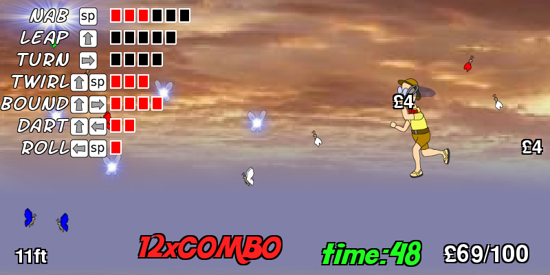

# Mortimer the Lepidopterist

Mortimer the Lepidopterist by Christopher Night (cosmologicon) Winner (Individual) for Pyweek 2010-08. 
- Forked by poikilos: <https://github.com/poikilos/lepidopterist>
  (old versions were uploaded as separate commits)

## Differences in Poikilos' fork
- Use a gamepad or joystick along with keys (using the MIT Licensed SoftController module: src/controller.py from [github.com/poikilos/SoftController](https://github.com/poikilos/SoftController)).
- Save the most recent statistics in a machine-readable format.
  - For running contests, collect and clear it (and savegame.pkl) between players manually or using another script.
    A score of 100 is good (in about 10 minutes) as a maximum for percentage-based player or team scores if capped at 100.

## Run the game
python3 run_game.py
- or in Windows, double-click "run_game.pyw" (choose the python location where you installed if it asks to choose a program--See "Requires").

### Requires
python3 (tested on 2.6.2) and pygame (tested on 1.9.4.post1)

Windows:
- Install [python](https://www.python.org/downloads/)
  - During install, you must check the option to **add Python to PATH**.

## HOW TO PLAY
1. Catch butterflies
2. Earn money
3. Buy upgrades that give you more abilities
4. Repeat

Follow the in-game tips.

### CONTROLS
(Numbers are gamepad buttons, numbered as labeled on the actual controller--starting with 1. All *italicized* controls are for menus.)
1. Enter: nab (with net) *or confirm/buy*
2. Tab: switch between the full and mini heads-up display (feat names)
3. Space: jump
4. Backspace: *back*
5. Esc: pause *or exit*
6. f: switch between fullscreen and window mode
7. F12 key: screenshot

Move: Arrow keys + or `a` & `d` 

Note that in the source code the button index is one less than these numbers (gamepad buttons are zero-indexed).

#### Mouse Controls
- nab (enter): left click within reach
- leap (space): right-click on your character if in the air.
  - If on ground, it will always leap.
- turn ('x' axis) left-click backward in air (on ground, left-click walks unless clicking within reach to nab)
- twirl ('nab' and 'leap') - left&right mouse buttons within reach at once
- dart ('jump' and 'x' axis) - right-click forward
- bound ('jump' and 'x' axis) - right-click backward
- roll ('nab' and 'x' axis) - middle-click forward in air (on ground, middle-click walks unless clicking within reach to nab)
- roll ('nab')

### Cheat codes
(enter on the stage select screen; only available if `not easy_locked()`)
up up down down up up down down - activate easy mode 
up down down down down up up up - watch all cut scenes and credits 
up down up up down up down down - delete the saved game and quit

## COMMAND-LINE OPTIONS
* `--nosound`: disable sound effects
* `--nomusic`: disable music
* `--fullscreen`: start game in fullscreen mode
* `--savefile=NAME`: use the specified save game instead of the default (savegame)
* `--restart`: delete the saved game before starting
* `--alwaysshow`: repeat cutscenes even if you've already seen them
* `--cheat`: start with all abilities unlocked and maxed out
* `--easy`: activate easy mode (only available if `not easy_locked()`)

## Authors & Licenses

Sprite Artwork and Code were relicensed. Formerly:
> All code and sprite artwork are original creations of Christopher Night.
> The copyrights to these are waived with a Creative Commons Zero waiver.
> They may be freely distributed with no attribution.

-Christopher Night

The new licensing for "Sprite Artwork" and "Code" are below under those sections. However, other licenses apply other media (see the "Media" section below).

### Code
MIT License (see LICENSE file in text editor or at [github.com/poikilos/lepidopterist](https://github.com/poikilos/lepidopterist/blob/master/LICENSE).

Original Pygame.org project page: 
<https://www.pygame.org/project-Mortimer+the+Lepidopterist-1696-2949.html> 

Entry in PyWeek #11  <http://www.pyweek.org/11/> 
Team: Universe Factory 11 
Members: Christopher Night (Cosmologicon) 

### Media

#### Textures
(data/*.jpg) are copyright cgtextures.com.
They are free for non-commercial use.

#### Sprite Artwork
Creative Commons Zero
- Christopher Night
- Jake "Poikilos" Gustafson
  - button.png
  - button-*.png
  - key-return.png

#### Fonts
* Merkin is freeware for all use, by Apostrophic Labs: <http://www.fontspace.com/apostrophic-lab/merkin>
* Kool Beans is freeware for all use, by Insanitype: <http://www.fontspace.com/insanitype/kool-beans>
* Quigley Wiggly is freeware for all use, by Nick's Fonts: <http://www.fontspace.com/nicks-fonts/quigley-wiggly>
* Fighting Spirit is freeware for non-commercial use, by Teabeer Studios: <http://www.fontspace.com/teabeer-studios/fighting-spirit-tbs>
* SF Arch Rival is freeware for non-commercial use, by ShyFoundry: <http://www.fontspace.com/shyfoundry/sf-arch-rival>
* freesansbold is distributed with pygame, available under Gnu LGPL: <http://www.pygame.org>

#### Music
* The Annual New England Xylophone Symposium is CC-BY by DoKashiteru: <http://ccmixter.org/files/DoKashiteru/19848>
* Another Girl (Instrumental) is CC-BY-NC by duckett: <http://ccmixter.org/files/duckett/23334>
* One Five Nine (SR Mix) is CC-BY-NC by IamTheStev <http://ccmixter.org/files/IamTheStev/19649>
* Gnosseinne 1 is CC-BY-NC by Erik Satie, arranged by Chad Crouch: <http://chadcrouch.bandcamp.com/track/gnossienne-1>

#### Sound Effects
(edited by Cosmologicon, based on the following sources)
* Till with Bell is CC-SAMPLING+ by Benboncan <http://www.freesound.org/samplesViewSingle.php?id=91924> [new CC BY 3.0 link](https://freesound.org/people/Benboncan/sounds/91924/)
* Swoosh is CC-SAMPLING+ by qubodup <http://www.freesound.org/samplesViewSingle.php?id=60009> [new CC0 link](https://freesound.org/people/qubodup/sounds/60009/)
* Video Game Power Up is [CC0](https://creativecommons.org/publicdomain/zero/1.0/) by AllMusicLibrary: <http://www.allmusiclibrary.com/free_sound_effects.php>

